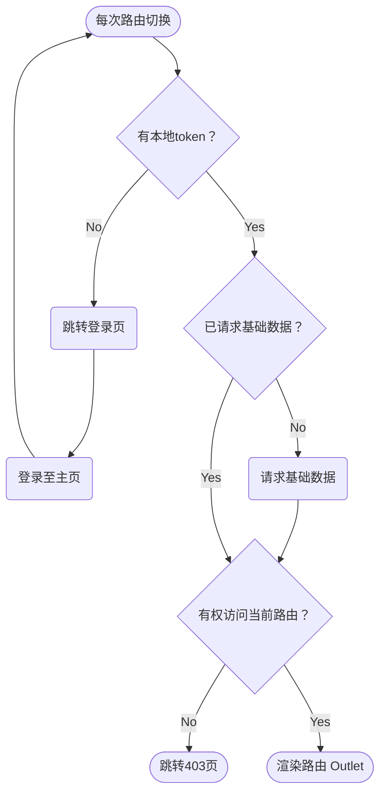

# 鉴权

鉴权是指，对**已登陆状态**和**当前路由访问权限**的验证。相关逻辑封装在一个高阶组件 `withAuth` 里，该组件将 `<ConsoleLayout />` 组件包裹。因此 `<ConsoleLayout />` 下的路由，每次切换时，都会执行鉴权逻辑。具体表现为：



- 每次路由切换，都会检查是否有本地token？
  - 若无本地token，则跳转登录页；
  - 若有本地token，则检查是否已请求基础数据？
    - 若未请求基础数据，则请求之；
    - 若已请求基础数据，则根据基础数据检查是否具备当前路由的访问权限？
      - 若无权限，则去 **403** 页。
      - 若有权限，则渲染路由 `<Outlet />`。

以上逻辑封装为 `withAuth` 高阶组件，在 `src/components/business/withAuth/index.tsx` 文件中

`ConsoleLayout` 组件被 `withAuth` 高阶组件包裹

::: code-group

```tsx [src/layouts/ConsoleLayout/index.tsx]
const ConsoleLayout = withAuth(() => {
  return <div>ConsoleLayout</div>;
});

export default ConsoleLayout;
```

:::

:::info
也可以编写自定义的 `CustomLayout` 布局组件，然后用 `withAuth` 高阶组件包裹，以达到鉴权效果
:::
